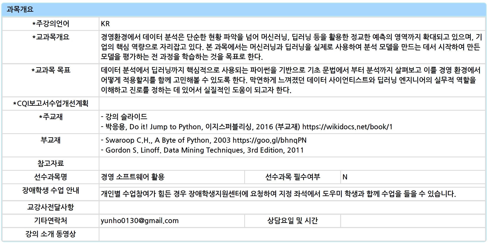
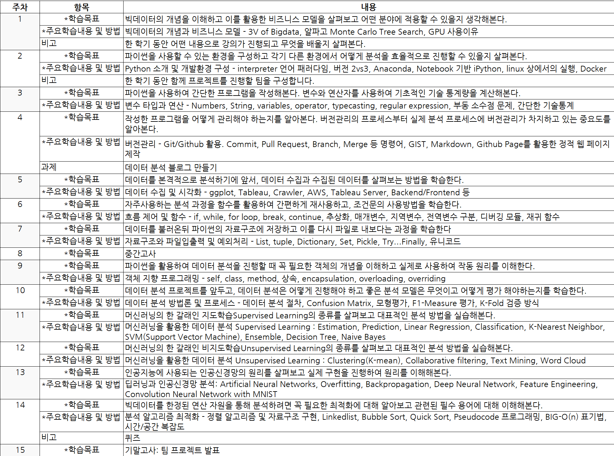
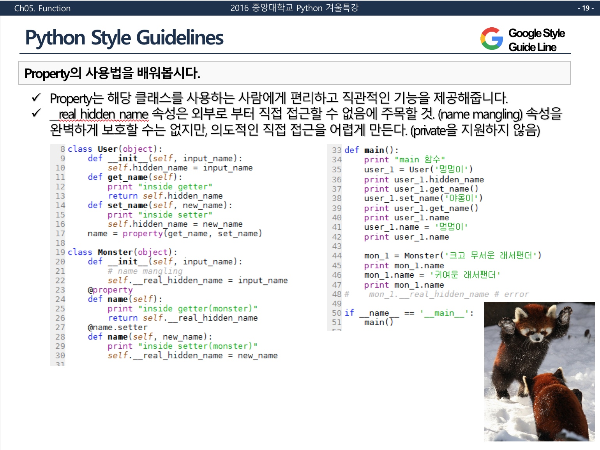
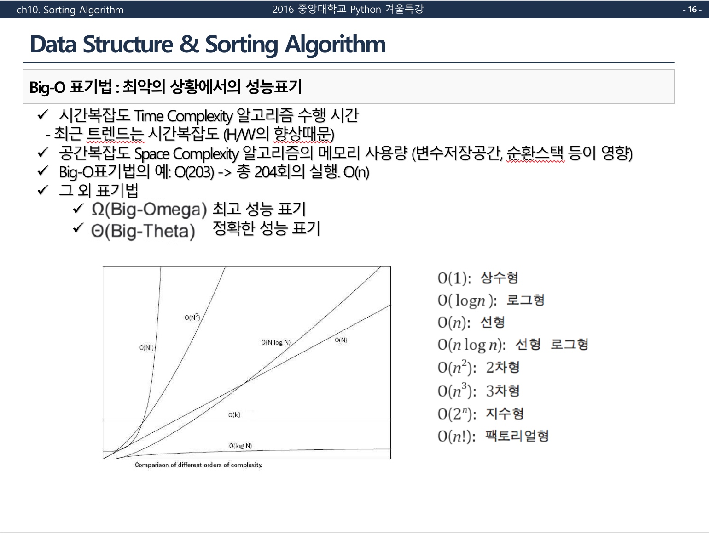
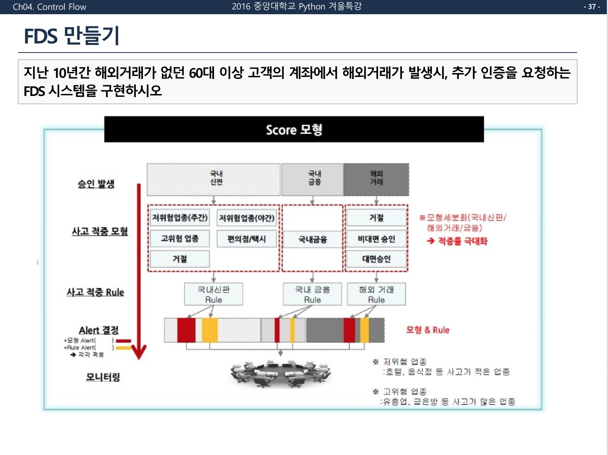

# Python Lectures

* 파이썬을 활용한 소스코드Source Code와 강의자료Lecture Slide)를 모아둔 Repository 입니다. 

## Business Bigdata Analysis
#### __[Star]버튼을 누르면, 강의자료 업데이트에 큰 힘이됩니다.__

* 2018년 2학기 상명대학교 경영빅데이터 분석과목 (2018년 12월 업로드 완료 예정)
* 강의슬라이드 및 소스코드 바로가기 `/2018_02_SMU_Lecture_Slide`  
	- <https://github.com/yunho0130/Python_Lectures/tree/master/2018_02_SMU_Lecture_Slide>  

#### 강의개요  

  

#### 주차별 강의 계획 Syllabus

## Start Programming with Google Python Style Guide

* 2016년 중앙대학교 Python 기초과목
* 강의슬라이드 및 소스코드 바로가기 `/2016_WV_CAU_Lecture_Slide`   
	- <https://github.com/yunho0130/Python_Lectures/tree/master/2016_WV_CAU_Lecture_Slide>

* 구글 파이썬 스타일 가이드로 시작하는 프로그래밍 Ver 1.1.1 (Last Update 2018-06-14)

* 본 Repository는 GPL-3.0 라이센스를 따릅니다. 상업적, 교육용, 개인적인 사용이 가능합니다. 자세한  라이센스 제약사항은 본 글 하단을 참조하세요.  

#### 강의개요  

프로그래밍을 처음 시작하는 분들에게 구글 파이썬 스타일 가이드를 기준으로 강의가 진행되었습니다. 여기에서 초점은 python보다는 '프로그래밍을 처음 시작하는 사람'에 맞추어져 있습니다. 난이도의 하향을 의미하는 것이 아닌, 프로그래밍을 할 때, 무엇을 염두해두어야 하는지에 초점을 맞추었습니다. 때문에 프로그래머로서 협업하는 방법, 현업과의 커뮤니케이션에 어떤 Tool들이 사용되는지 등에 대해서도 본 강의는 다루게 됩니다.   

#### 주차별 강의 계획 Syllabus

#### 강의 자료 구성
* 강의 슬라이드는 복습 => 구글 스타일 가이드 확인 => 파이썬 문법 기반의 진도=>과제의 순으로 구성되어 있습니다. 
    - 구글 스타일 가이드 확인 예시

    - 파이썬 문법 진도 예시
  
    - 과제 예시

* Python 수업중에 사용된 코드 (Live Coding으로 수업시간에 진행했던 코드)  
<https://gist.github.com/yunho0130>  

# Business Bigdata Analysis using Python
* `2018_02_SMU_Lecture_Slide` 2018년 2학기 상명대학교 python 강의에 사용되었던 Source Code와 강의 자료 repository 입니다.  

#### 개발환경 및 사용프로그램

* Anaconda  
<https://www.continuum.io/downloads>

* SublimeText2  
<https://sublimetext.com/2>  

* Pycharm Edu    
<https://www.jetbrains.com/pycharm-edu/download/>  

* Vim Editor  
<http://www.vim.org/download.php>  

#### 요약자료 (Cheat Sheet) 

* Pycharm Cheat Sheet  
<https://github.com/yunho0130/CAU_Python/blob/master/Cheat_sheet/PyCharm_Reference_Card.pdf>

* GitHub Cheat Sheet   
깃허브 기능 모음  
<https://github.com/yunho0130/github-cheat-sheet/blob/master/README.ko.md>  

* git rebase 연습하기  
<http://learnbranch.urigit.com/>  

* Markdown  
 - 마크다운 문법 모음   
<http://blog.kalkin7.com/2014/02/05/wordpress-markdown-quick-reference-for-koreans/>   
 - John Gruber markdown  
<https://nolboo.kim/blog/2013/09/07/john-gruber-markdown/>  

* Almind (교재 요약 마인드맵 여는데 필요)
<http://www.altools.co.kr/Download/ALMind.aspx>  

#### 서적 및 코드 모음

* awesome-python  
각 상황별 파이썬 frameworks, libraries 등 모음  
<https://github.com/yunho0130/awesome-python>

* Data Analysis   
"Python for Data Analysis" by Wes McKinney, published by O'Reilly Media  
<https://github.com/yunho0130/pydata-book>

#### 기타 

* Google Python Style Guide 저자 명시  
 - Python 프로그래밍에 있어, 가이드 라인을 작성해주신 Amit Patel, Antoine Picard, Eugene Jhong, Jeremy Hylton, Matt Smart, Mike Shields 님들께 감사드립니다.

* PEP8 vs Googlel Python Style Guide   
 - 언어의 창시자가 만든 컨벤션도 물론 중요하지만, 실제로 현업에서 어떻게 사용되는지를 더 중요하게 생각하고 Google의 기준을 기준으로 삼았습니다. 이 부분 감안하시기 바랍니다. 

#### LICENSE   
 - 기본적으로 GPL-3.0 라이센스를 따릅니다. 아래의 항목은 GPL-3.0에 추가적인 항목입니다.   
 - GPL 라이센스의 사용은 여러 인용/차용한 Reference Opensource 자료들의 최상위 항목이기 때문에 적용하였습니다.  
 - 저작자 명시 배포를 허용합니다.  
 - 서적출판, 특허, 2차 라이센스는 허용하지 않습니다. (공동 저자는 연락주세요) 
 - 비영리 출처표기에 의한 인용 자료의 경우, 해당 원작자의 라이센스 정책을 따릅니다. 

#### Version Update History  
 - 2.0.0 상명대 데이터 분석 강의자료 업로드 시작
 - 1.1.1 마이너 README.md 업데이트
 - 1.1.0 Pull Request 반영, 실러버스 이미지 수정, Disclaimer 추가
 - 1.0.3 저자정보 업데이트 
 - 1.0.2 Readme 수정  
 - 1.0.1 최초 외부 공개본 (저작권 관련 커밋 및 로그 추가)  
 - 1.0.0 최초 수업 공개용 완성    

#### 저자: 맹개발 <http://maengdev.tistory.com/166>
> 저자는 현재 IBM Watson Cognitive 엔지니어로 근무하고 있으며, 연세대학교 정보대학원에서 비즈니스 빅데이터 분석 석사과정을 전공했다. California에서 실시된 AutoDevBot 해커톤에서 준우승하였으며, 카네기멜론 아시아 STEM Academy와 중앙대학교에서 Python을 강의했다. SK C&C, 한국과학기술정보연구원(KISTI), 한국연구재단(NRF), DBpia 등에서 프로젝트를 수행하였으며, 오픈소스 활동으로 Apache Zepplin, 양자컴퓨팅 Python SDK인 QISKIT에 기여했다.

#### Disclaimer

- 참고로 저는 구글과 아무 관련이 없으며, 웹상에 공개되어 있는 Google Python Style Guide의 내용을 기반으로 강좌를 구성하였습니다.(CC-4.0 라이센스로 상업적 사용 무관, <https://google.github.io/styleguide/pyguide.html>) 
- 본 레파지토리는 몇몇의 파이썬 학습자료를 모아둔 곳입니다. 개인의 자격으로 운영되며 작성자의 소속과 관련이 없습니다. 또한, 본 레파지토리에 있는 코드를 사용할 경우 발생하는 모든 종류의  문제(기술적/보안적/법률적/etc)를 책임지지 않습니다. This repository is consist of several python learning materials. Not related to current job and organization. It's personal repository. So I have no responsibility for using this code about all kind of problems such as technical/security/legal/etc. 

 

